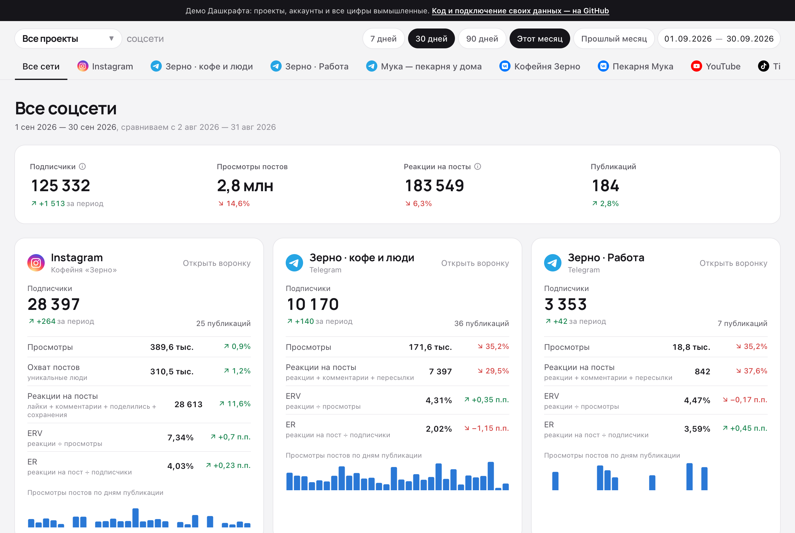
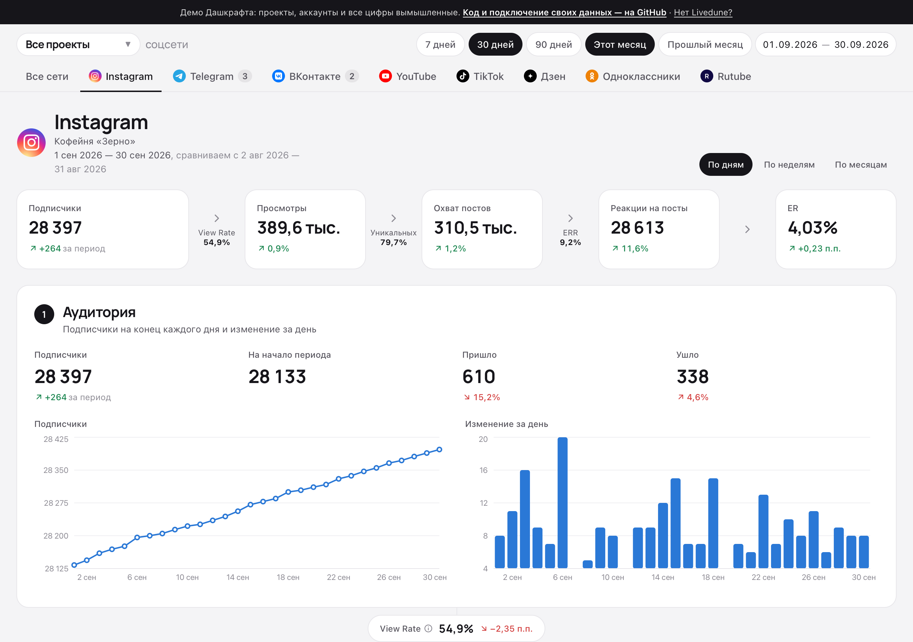
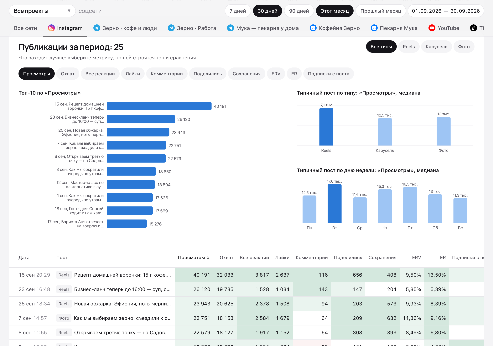

# Дашкрафт



[](LICENSE)
[](https://nextjs.org)
[](https://www.typescriptlang.org)

SMM-дашборд по данным Livedune: воронка, динамика и посты по всем вашим соцсетям

Дашкрафт собирает все аккаунты из вашего [Livedune](https://pro.livedune.com?from=72df001bad) в один отчёт: Instagram, Telegram, ВКонтакте, YouTube, TikTok, Дзен, Одноклассники, Rutube и остальные. Для каждого аккаунта строится воронка от подписчиков до вовлечения, показывается динамика по дням, неделям и месяцам и видно, какие посты сработали лучше или хуже обычного. Каждое число сравнивается с прошлым периодом такой же длины.

Дашкрафт работает у вас на компьютере. Ключ Livedune и статистика никуда не уходят, кроме самого Livedune.

**[Открыть демо →](https://nosenss.github.io/dashcraft/)** Там два вымышленных проекта — кофейня «Зерно» и пекарня «Мука», все цифры сгенерированы.

## Возможности

- **Подстраивается под ваш Livedune**: вкладки и карточки строятся из подключённых аккаунтов. Несколько Telegram-каналов — у каждого своя вкладка и воронка. Несколько проектов — переключатель в шапке.
- **Любые соцсети Livedune**: для Instagram, Telegram, ВКонтакте, YouTube, TikTok и Дзена формат сверен на живых данных. Одноклассники, Max, Rutube, Facebook, X, Threads, Pinterest, LinkedIn и Likee настроены по описанию Livedune и помечены как несверенные. Сеть, которой нет в списке, всё равно покажется по общим метрикам.
- **Воронка по каждому аккаунту**: подписчики → просмотры → охват → реакции → ER, между шагами View Rate, ERV и ERR.
- **Сводка «Все сети»**: все аккаунты рядом, общий итог и лучшие посты относительно медианы каждого аккаунта.
- **Динамика**: графики по дням, неделям и месяцам поверх прошлого периода. Вирусные всплески не ломают шкалу.
- **Разбор постов**: топ по выбранной метрике, типичный пост по типу контента и дню недели, таблица с подсветкой относительно медианы.
- **Любой период**: «7 / 30 / 90 дней», «этот / прошлый месяц» или свои даты.
- **Бережно к лимиту API**: дисковый кэш и повторы при 429/5xx. Если Livedune не ответил, показываются последние данные с пометкой.

| Воронка аккаунта | Разбор постов |
|---|---|
|  |  |

## Что понадобится

- **Livedune с тарифом, где хватает запросов к API.** Дашкрафт берёт данные через API Livedune, а у каждого тарифа свой лимит запросов в месяц ([подробнее в вики Livedune](https://wiki.livedune.com/ru/articles/11640100-api/)):

  | Тариф | Запросов API в месяц |
  |---|---|
  | Триал | 100 на весь пробный период |
  | Фримиум | 100 |
  | Блогер | 2 000 |
  | Бизнес | 10 000 |
  | Агентство | 100 000 |

  Дашкрафт тратит примерно 2–4 запроса на аккаунт каждый раз, когда вы открываете новый период, а повторные открытия берутся из кэша. 100 запросов Триала и Фримиума хватит на несколько просмотров, поэтому для постоянной работы нужен тариф от «Блогера», а если аккаунтов много — «Бизнес» или «Агентство». Если запросы кончились, их можно докупить в Livedune.

  Ещё нет Livedune — [зарегистрируйтесь по ссылке](https://pro.livedune.com?from=72df001bad).
- **Приложение с ИИ-агентом, который работает на вашем компьютере**: Claude (десктоп-приложение, раздел Code), Codex или Cursor. Обычный чат с нейросетью в браузере не подойдёт: он не может ничего установить на компьютер.

## Установка

Ничего делать руками не нужно: всё поставит ИИ-агент.

1. Скопируйте API-ключ Livedune: [pro.livedune.com/settings/api](https://pro.livedune.com/settings/api).
2. Откройте ИИ-агента и отправьте ему сообщение, вставив свой ключ:

   ```text
   Установи Дашкрафт у меня на компьютере: https://github.com/nosenss/dashcraft
   Действуй по инструкции из AGENTS.md в репозитории.
   Мой ключ Livedune: ВСТАВЬТЕ_КЛЮЧ
   ```

3. Агент будет спрашивать разрешение на действия: скачать проект, установить программы, запустить дашборд. Разрешайте. Он сам проверит ключ и остаток запросов, покажет ваши проекты и спросит, какие показывать.
4. В конце на рабочем столе появится ярлык «Дашкрафт», а дашборд откроется в браузере.

Дальше дашборд открывается двойным кликом по ярлыку. Откроется ещё служебное окно — не закрывайте его, пока смотрите дашборд.

Ключ хранится только у вас на компьютере, в файле настроек Дашкрафта, и никуда не публикуется. Кроме вас его видит только сервис нейросети, в чат которой вы его отправили.

<details>
<summary>Установка вручную, для тех, кто работает с терминалом</summary>

Нужен [Node.js 20 или новее](https://nodejs.org).

```bash
git clone https://github.com/nosenss/dashcraft.git
cd dashcraft
npm install
npm run setup   # спросит ключ Livedune и какие проекты показывать
npm run dev     # http://localhost:3000
```

`npm run shortcut` создаст ярлык «Дашкрафт» на рабочем столе.

Ключ Livedune берётся здесь: [pro.livedune.com/settings/api](https://pro.livedune.com/settings/api).

</details>

<details>
<summary>Настройки в .env.local</summary>

`npm run setup` заполняет их сам, но их можно поменять и вручную.

| Переменная | Что делает |
|---|---|
| `LIVEDUNE_TOKEN` | API-ключ Livedune. Без него работает демо |
| `LIVEDUNE_PROJECT` | Проекты Livedune через запятую. Пусто — все проекты, а в шапке появится переключатель |
| `LIVEDUNE_ACCOUNTS` | Номера аккаунтов Livedune через запятую, если нужны не все |
| `DASHBOARD_TITLE` | Название в шапке. Пусто — название проекта или «Дашкрафт» |
| `DEMO_MODE` | `1` — показывать демо-данные, даже если ключ задан |

Проверить ключ, остаток запросов и список аккаунтов: `npm run setup -- --check`.

</details>

## Если нужно показать дашборд другим

Дашкрафт рассчитан на запуск у себя на компьютере. Если хотите открыть его коллегам или клиенту по ссылке, выложите его на свой сервер или хостинг, где работает Next.js (`npm run build && npm start`).

> [!WARNING]
> Обязательно закройте такой дашборд паролем: Vercel Password Protection, Cloudflare Access, basic auth на прокси и т. п. Без пароля вашу статистику увидит любой, у кого есть ссылка, а каждый его заход будет тратить ваш лимит API Livedune.

На хостингах с диском только для чтения кэш не пишется, и каждый запрос уходит в Livedune.

## Как считаются метрики

- Итоги за период считаются по постам, опубликованным в этом периоде. Формулы как в Livedune:
  - **ER** = (вовлечение ÷ постов) ÷ подписчики;
  - **ERV** = вовлечение ÷ просмотры;
  - **ERR** = вовлечение ÷ охват.
- **Вовлечение** = лайки или реакции + комментарии + репосты, пересылки и «поделились» + сохранения.
- Графики «по дням» считают по дате публикации поста. Подписчики, а у Instagram ещё охват и показы аккаунта, берутся из дневной истории Livedune.
- Сравнение идёт с предыдущим периодом такой же длины.
- Ответы Livedune кэшируются в `.cache/`: текущий период на 30 минут, закрытый на сутки. Кнопка «Обновить» сбрасывает кэш.

## Для разработчиков

```
app/               страницы и API-роуты (Next.js App Router)
components/        интерфейс: шапка, воронка, графики, таблица постов
lib/networks.ts    соцсети: как узнать по типу аккаунта Livedune, иконки, названия реакций
lib/accounts.ts    вкладки, проекты и фильтры аккаунтов
lib/report.ts      сборка отчёта по аккаунту и сводки
lib/metrics.ts     формулы и агрегации, общие для сервера и браузера
lib/livedune/      клиент Livedune API с повторами и дисковым кэшем
lib/demo.ts        генератор демо-данных в формате Livedune API
lib/source.ts      выбор источника: Livedune или демо
demo-app/          страницы статического демо для GitHub Pages
scripts/           установка (setup), проверка API, сборка демо, скриншоты
AGENTS.md          инструкция для ИИ-ассистентов
```

Стек: Next.js 15, React 19, TypeScript, Tailwind CSS 4, Recharts.

**Демо на GitHub Pages.** `npm run build:pages` собирает статическую версию на демо-данных в `out/`: отчёт считается прямо в браузере тем же кодом. Workflow [`.github/workflows/pages.yml`](.github/workflows/pages.yml) выкладывает её при каждом пуше в `main`. В форке включите Settings → Pages → Source: GitHub Actions.

**Скриншоты** в `docs/` снимаются из собранного демо: `npm run build:pages`, раздать `out/` по адресу `http://localhost:3200/dashcraft/` и запустить `swift scripts/screenshots.swift` (macOS).

**Новая соцсеть.** Сеть узнаётся по типу аккаунта Livedune в `lib/networks.ts`. Сырой ответ API: `npm run probe -- page <id аккаунта> posts <с> <по>`.

## Участие

Баги и идеи пишите в [Issues](https://github.com/nosenss/dashcraft/issues). Особенно полезно, если у вас подключена несверенная сеть и цифры расходятся с кабинетом Livedune. Перед пулреквестом проверьте, что проходит `npm run build`.

## Лицензия

[MIT](LICENSE)
